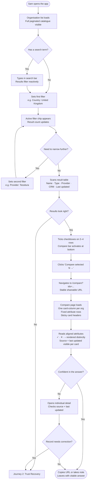
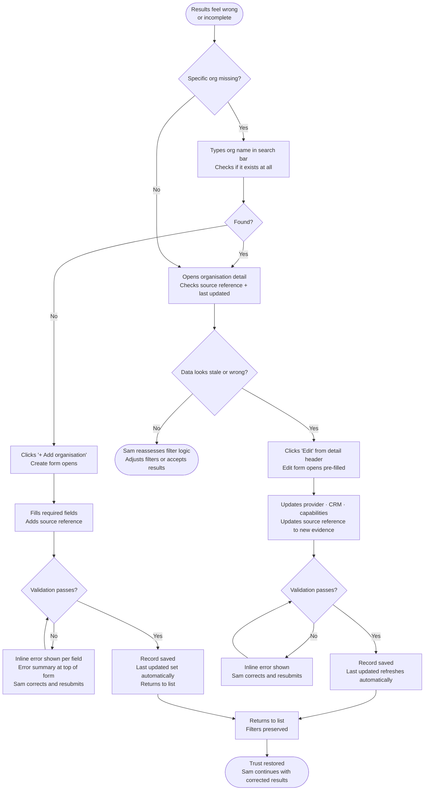
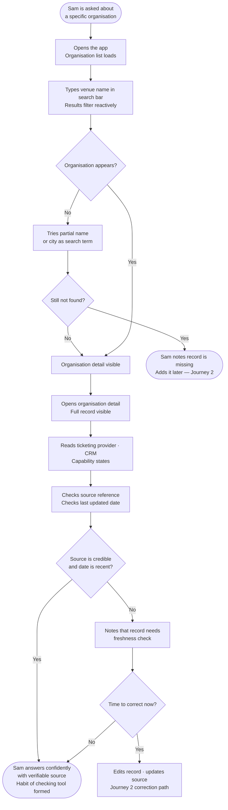
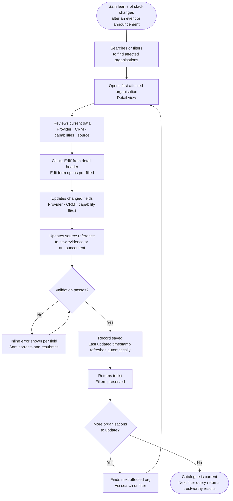

---
stepsCompleted:
  - step-01-init
  - step-02-discovery
  - step-03-core-experience
  - step-04-emotional-response
  - step-05-inspiration
  - step-06-design-system
  - step-07-defining-experience
  - step-08-visual-foundation
  - step-09-design-directions
  - step-10-user-journeys
  - step-11-component-strategy
  - step-12-ux-patterns
  - step-13-responsive-accessibility
  - step-14-complete
inputDocuments:
  - _bmad-output/project-context.md
  - _bmad-output/planning-artifacts/prd.md
---

# UX Design Specification — dmcf-app

**Author:** Argirisdak
**Date:** 2026-04-01

---

<!-- UX design content will be appended sequentially through collaborative workflow steps -->

## Executive Summary

### Project Vision

DMCF Ticketing Stack Mapper is an internal web application that transforms tribal, perishable knowledge about cultural organisations' ticketing stacks and CRM tools into a shared, citable, queryable catalogue. The core shift is from informal recall — spreadsheets, Slack threads, people who happen to remember — to institutional knowledge with provenance: every record carries a source reference and a system-maintained last-updated timestamp. The product's value is not that it looks better than a spreadsheet; it is that it makes multi-dimensional queries trustworthy (for example, country and ticketing provider simultaneously), that it is correctable by anyone with access, and that it grounds procurement, partnership, and research decisions in verifiable data rather than whoever is in the room.

### Target Users

A single internal user type: "Sam" — DMCF programme and research staff who maintain and consult the catalogue. Sam is non-technical by expectation, working on a desktop or laptop, often under time pressure (preparing internal notes, briefing colleagues, onboarding). Sam is task-focused: they arrive with a question and need a confident answer quickly. They are not browsing for discovery — they are filtering for a specific slice of the landscape. The 60-second filter-to-compare anchor defines Sam's tolerance: if the flow is slower or more effortful than that, the spreadsheet stays. Sam also wears a curator hat: when they spot a stale or wrong record, they must be able to correct it with a source and move on without friction.

### Key Design Challenges

1. **Data density vs. clarity in the list view** — The table must show enough at a glance (name, country, provider, last updated) to be immediately useful, without overwhelming non-technical staff. Every column earns its place or gets cut.
2. **Compare readability at data density** — Aligning attributes across multiple organisations in a legible side-by-side layout is the centrepiece of the 60-second success path. Making it work for non-technical users — where "unknown" vs. blank actually means something different — is the hard design problem.
3. **Filter trust and recovery** — When results feel wrong, Sam needs to understand why without becoming a detective. Source and last-updated must be surfaced, not buried, and the path from doubt to correction must be short.
4. **Three-state capability model** — Unknown, yes, and no must be visually distinct and instantly scannable in both list and compare views. Text alone will not do it at density.

### Design Opportunities

1. **Provenance as a confidence indicator, not a footnote** — Source reference and last updated, designed as first-class trust signals at the list level (not just the detail view), elevate the catalogue from a database to a living, authoritative record.
2. **Selection-to-compare as a guided journey** — Checkboxes in the list view that activate a persistent "Compare selected" affordance create a low-friction, natural flow. The transition into compare should feel like a reveal, not a page reload.
3. **Progressive disclosure across list → detail** — The list shows the essentials; detail expands to everything. Sam should never feel lost or like they are missing something important at either level.
4. **Empty states that teach, not just inform** — When filters return nothing, or a capability is genuinely unknown, the empty state becomes a curation prompt: "No results for these filters — try removing one" or "Capability not recorded — edit to add."

## Core User Experience

### Defining Experience

The primary loop is **filter → scan → select → compare**. The highest-frequency action is filtering and scanning the list — compare is the pay-off, but the list is the daily habit. The entire product's value rests on how quickly and confidently Sam can narrow the catalogue to the slice they need and trust what they see.

The single interaction that must be completely right: **applying multiple filters and seeing results that feel correct**. If the first filter interaction feels unreliable — wrong results, missing known entries, stale data — the tool loses credibility and the spreadsheet returns. Everything else is secondary to this moment of trust.

### Platform Strategy

- **Web application, desktop-first** — Sam works on desktop or laptop in an office or remote context; minimum comfortable width approximately 1280px
- **Mouse and keyboard** primary — no touch-specific interactions required for MVP; keyboard access to primary flows (navigation, filters, forms) is a baseline requirement
- **No offline functionality** — internal tool on a trusted network; online connectivity assumed
- **Browser target:** Chromium (Chrome/Edge), Firefox, Safari current — no IE or legacy support

### Effortless Interactions

The following must require zero thought or friction from Sam:

- **Filter application and removal** — reactive, no page reloads, no waiting; adding a filter narrows results instantly; removing one expands them just as fast
- **Selecting organisations for compare** — checkboxes in the list that activate a persistent "Compare selected" affordance; picking organisations should feel like picking something up, not submitting a form
- **Navigating between list and detail and back** — Sam should always know where they are and how to return; no dead ends
- **Editing a record from its detail view** — one or two actions from anywhere the record is visible; the path from "I notice this is wrong" to "I've fixed it with a source" must be short
- **System-maintained last updated timestamp** — Sam never manually sets a freshness date; the system handles it on every save, invisibly

### Critical Success Moments

1. **First correct filter result** — Sam applies country + provider; the list narrows to exactly the slice they expected. This is the moment institutional trust is established. If this moment fails, nothing else matters.
2. **The compare reveal** — Sam opens the comparison view and attributes line up cleanly across organisations. Unknown is visually distinct from blank. Provenance is visible without drilling in. This is where the tool earns its keep against a spreadsheet.
3. **Source check under pressure** — Sam is in a meeting, opens a record on their laptop, reads the source and last-updated date, and quotes it to the room with confidence. The habit of checking the tool first is born here.
4. **First successful correction** — Sam finds a stale record, edits provider and source, saves. The last-updated timestamp reflects the change. The catalogue is demonstrably more accurate than it was five minutes ago.

### Experience Principles

1. **Trust before speed** — Every design decision that trades clarity or data integrity for visual speed is wrong. Sam must trust the results before they can act on them.
2. **Provenance is part of the answer** — Source and last-updated are not metadata footnotes; they are part of the answer Sam takes out of the tool. Design them accordingly.
3. **The list is the product** — Filter controls, the result table, and the selection mechanism are the centre of gravity. Everything else (detail, create, edit, compare) serves or returns to the list.
4. **Corrections must be frictionless** — The tool improves when staff correct it. Any friction between "I see a problem" and "I've fixed it" degrades institutional knowledge over time.
5. **Non-technical language everywhere** — Labels, empty states, validation messages, and navigation copy are written for research staff, not developers. Plain British English throughout.

## Desired Emotional Response

### Primary Emotional Goals

The dominant target emotion for this tool is **confidence** — quiet, durable, grounded in verifiable data. This is not a consumer product chasing delight or surprise; it is a professional tool whose emotional success is measured by whether Sam leaves an interaction feeling more certain than when they arrived. The secondary emotional goal is **agency**: the sense that when something is wrong, Sam can fix it, and the catalogue will be better for it.

### Emotional Journey Mapping

| Stage | Target feeling | Anti-target (what to avoid) |
|-------|---------------|------------------------------|
| First use | Orientation — "I can see how this works" | Confusion, paralysis |
| Filtering and scanning | Focused and in control — "I'm narrowing in on what I need" | Anxiety, doubt about results |
| Comparing results | Clarity and confidence — "I can see the difference clearly" | Cognitive overload, ambiguity |
| Finding something wrong | Agency — "I can fix this; I know what to do" | Frustration, helplessness |
| After completing a task | Quiet accomplishment — "That was faster than the old way" | Residual doubt |
| Returning to the tool | Reliability and habit — "This is where I go first" | Reluctance, workaround-seeking |

### Micro-Emotions

The most critical emotional axes for this product, in priority order:

1. **Confidence vs. doubt** — the defining axis; if filter results feel unreliable or provenance is invisible, the tool fails emotionally regardless of technical correctness
2. **Agency vs. helplessness** — particularly when records are wrong or incomplete; Sam must feel empowered to correct, not frustrated into abandoning the tool
3. **Orientation vs. confusion** — Sam must always know where they are, what they are looking at, and what they can do next; disorientation at any point breaks the 60-second anchor

### Design Implications

- **Confidence** → normalised reference data (consistent filter vocabulary), visible source and last-updated at the list level, explicit empty states that explain rather than merely report
- **Agency** → short, discoverable edit path from the detail view; clear, plain-English validation messages; delete with confirmation (not silent destruction)
- **Orientation** → persistent navigation, active filter indicators, clear page titles, breadcrumbs or back affordances between list and detail
- **Avoiding overload in compare** → aligned columns with clear attribute labels, visually distinct unknown/yes/no states, sensible maximum number of simultaneously compared organisations
- **Avoiding ambiguity in capabilities** → the three-state model (unknown / yes / no) must be rendered with distinct iconography or colour tokens, never text alone at table density

### Emotional Design Principles

1. **Make confidence visible** — trust signals (source, last updated, filter match count) are surfaced at the right level, not buried. Sam should not have to dig to feel certain.
2. **Agency as a design feature** — the correction path (edit → source → save) is as carefully designed as the read path. The tool gets better when used; make that feel natural.
3. **Calm density** — data-dense tables and filter controls should feel organised and readable, not clinical or overwhelming. Generous whitespace, consistent alignment, and restrained use of colour achieve calm without sacrificing information.
4. **Plain language earns trust** — every label, error message, and empty state is written for a non-technical researcher. Jargon, ambiguity, or developer-facing messages undermine the confidence the design is trying to build.

## UX Pattern Analysis & Inspiration

### Inspiring Products Analysis

**Airtable (list and filter experience)**
Airtable's grid view sets the standard for filterable, scannable data tables aimed at non-technical users. Its strengths for this project: persistent active-filter indicators above the table, colour-coded categorical tags for select fields that make provider and type values instantly scannable, and consistent column alignment that supports rapid comparison within the list itself. The interaction model — filter the grid, see results immediately, clear one filter at a time — maps directly to Sam's primary loop.

**GOV.UK Design System (clarity and language)**
The GOV.UK Design System is the benchmark for public-sector and internal tools serving non-technical users under real-world pressure. Its core contribution to this project is the language and form pattern system: labels above fields, hint text below, specific error messages ("Enter a valid source reference" not "Field required"), and error summaries at the top of the page before the offending fields. Its colour system is entirely functional — no decorative use of colour. Accessibility (visible focus, semantic headings, keyboard navigation) is structural, not an afterthought.

**Rightmove / Zoopla (side-by-side comparison)**
Property listing comparison demonstrates the correct structural solution for comparing heterogeneous records: fixed attribute rows on the left, one card-column per selected item, summary information prominent at the top of each card, and sticky column headers as the user scrolls. Crucially, these tools never leave a cell blank — "Not available" or a dash is always rendered explicitly, distinguishing "we don't know" from "this field doesn't exist." A clear per-column remove affordance keeps the selection manageable.

### Transferable UX Patterns

**Navigation and filter patterns**
- Active filter chips / tags displayed persistently above the results table — Sam can see applied filters at all times and remove individual ones without reopening a panel
- Immediate reactive filtering — no "Apply" button required; results update as filters are set or cleared
- Filter controls grouped logically (location: country; stack: provider, CRM; capabilities: membership, donation, reserved seating)

**Interaction patterns**
- Checkbox selection within the list row activates a persistent "Compare selected (N)" affordance — floated or fixed at the bottom or top of the list; never requires a separate step to initiate
- GOV.UK-style delete confirmation: show a summary of what will be deleted and require explicit confirmation before the action executes
- Edit path accessible directly from the detail view header — one clear action, not buried in a menu

**Visual and display patterns**
- Colour-coded categorical tags for ticketing provider, CRM, and organisation type — consistent token per value, muted palette, legible at table density
- Three-state capability rendering: distinct icon per state (tick for yes, dash for unknown, cross for no) — never text alone at grid density
- Compare layout: fixed attribute label column on the left, one card-column per selected organisation, sticky card headers, explicit rendering for unknown values (never blank)

### Anti-Patterns to Avoid

- **Airtable's mode complexity** — no view switching, no formula fields, no multi-layout options; this is a single focused mode
- **Blank cells in compare** — blank is not the same as unknown; every attribute must render a value state, even if that state is "not recorded"
- **Filter panels that hide applied state** — if Sam has to open a drawer to remember what filters are active, trust in results erodes
- **Generic validation errors** — "This field is required" is not acceptable; every error message names the field and states what to provide
- **Marketing chrome on a functional tool** — no promotional patterns, hover-upsells, or attention-hijacking interactions
- **Infinite scroll on the organisation list** — explicit pagination keeps the dataset navigable and the UI state predictable

### Design Inspiration Strategy

**Adopt directly:**
- Airtable's active filter chip pattern above the results table
- GOV.UK's form structure: label → hint → field → inline error; error summary at page top
- GOV.UK's plain-English error and empty-state copy conventions
- Rightmove/Zoopla's compare column structure: fixed label row, card-columns, sticky headers, explicit unknown rendering

**Adapt for context:**
- Airtable's colour-tagged select values → restrained, functional Tailwind token palette appropriate for an admin tool (muted, not vibrant)
- Rightmove/Zoopla's card header summary → adapted for organisation records (name, type, country as the hero summary at the top of each compare column)
- GOV.UK's "check your answers" confirmation pattern → applied specifically to the delete flow

**Avoid entirely:**
- Airtable's power-user surface area and UI density beyond the grid
- Property site marketing patterns and promoted content
- Any decorative visual complexity — trust is earned through calm clarity, not visual interest

## Design System Foundation

### Design System Choice

**Tailwind CSS + shadcn/ui (Radix UI primitives)**

Tailwind CSS is mandated by the project context as the sole styling approach. The chosen component strategy builds on this with shadcn/ui — a copy-paste component library built on Radix UI accessibility primitives, styled entirely with Tailwind classes. Components are copied into the codebase rather than installed as a runtime dependency, meaning there is no library lock-in and no conflict with the project's "no unnecessary dependencies" principle.

### Rationale for Selection

- **Accessibility without build cost** — Radix UI primitives provide correct ARIA attributes, focus management, and keyboard interaction for modals (delete confirmation), dropdown filter controls, and combobox selects; building this correctly from scratch would be slow and error-prone at MVP pace
- **Consistent with project constraints** — copy-paste model means only used components enter the codebase; no runtime package dependency introduced
- **Correct aesthetic register** — shadcn/ui's default visual style (clean, neutral, functional) aligns with the "clean admin tool, not a marketing product" target without requiring significant overriding
- **Small team, MVP scope** — accessible form components, modals, and dropdowns are delivered without diverting engineering effort from the core product logic

### Implementation Approach

- Tailwind configuration extended with a functional token palette: neutral greys as the base, a single muted accent for interactive states and selection affordances, and semantic colour tokens for capability states (yes / no / unknown)
- shadcn/ui components adopted selectively: Button, Input, Select, Checkbox, Dialog (delete confirmation), Table, Badge (for provider/CRM/type tags), and Pagination
- All component styling remains in Tailwind utility classes — no plain CSS files except the global reset already permitted by project context
- British English used in all component copy, labels, and placeholder text throughout

### Customisation Strategy

- **Colour tokens:** neutral slate palette for base UI; a single muted blue or teal accent for interactive and selection states; green/amber/grey semantic tokens for capability yes/no/unknown states — restrained, never vibrant
- **Typography:** system font stack for body; clear size and weight hierarchy for table headers, field labels, and page titles — no decorative typefaces
- **Density:** table rows at comfortable density for desktop reading sessions; generous enough padding that non-technical users do not feel overwhelmed, tight enough that 20 rows fit comfortably in a viewport without scrolling
- **Icons:** a single consistent icon set (e.g. Lucide, which ships with shadcn/ui) used exclusively for capability state indicators, action buttons, and navigation affordances — never decorative

## Defining Experience

### 2.1 Defining Experience

**"Filter to confident answer in one flow."**

Sam arrives at the organisation list with a research question. They set two or more filters, scan the narrowed results, select the organisations that matter, open a dedicated compare page, and leave with a sourced, trustworthy answer — without opening a second tab, consulting a spreadsheet, or pinging a colleague. This arc, end-to-end and unbroken, is the product's core value proposition made tangible.

### 2.2 User Mental Model

Sam brings spreadsheet muscle memory: scan a column, filter, copy values into a document. The tool must feel familiar enough to require no training — but better in the specific moments where spreadsheets fail: multi-column filtering that holds its state, side-by-side comparison that does not require manual alignment, and a source reference that is not a sticky note or a memory.

The mental model to lean into is **search results + comparison shopping**: "show me organisations in country X that use provider Y." That is a filter query, not a formula. The compare experience should feel like comparing two product listings — structured, aligned, scannable — not like reading a pivot table.

**Where confusion will surface:**
- The three-state capability model (unknown / yes / no) — Sam's spreadsheet instinct treats blank and "no" as equivalent; the distinction must be rendered unmissably at first encounter
- Filter state on navigation — if Sam opens a detail view and returns, filters must be preserved; losing filter state mid-task is a trust-breaking moment
- Multi-select accumulation — Sam needs to understand that ticking checkboxes is building a selection, not triggering an immediate action; the persistent compare affordance makes this clear

### 2.3 Success Criteria

The core interaction succeeds when:
- Sam can apply two or more filters and see results narrow **reactively**, without a page reload or "Apply" button
- Active filters are **always visible** as chips above the table — Sam never has to wonder what is applied
- Selecting organisations for compare **activates a persistent affordance** that is impossible to miss
- The compare page renders attributes **in aligned rows** across organisations, with **no blank cells** — every attribute has an explicit state
- Source reference and last updated are **visible on the compare page** without drilling into individual records
- Filter state is **preserved** when navigating to detail and back
- The compare page has a **stable, shareable URL** containing the selected organisation IDs

### 2.4 Novel vs. Established Patterns

All core interactions use **established patterns** that Sam already understands — filter dropdowns, checkboxes, side-by-side columns, paginated tables. There is nothing novel to teach. The only interaction requiring explicit visual education is the **three-state capability model**; this is handled through distinct iconography and a visible legend on first encounter, not a tutorial or onboarding flow.

The compare view is a **dedicated page with its own URL** (e.g. `/compare?ids=abc,def,xyz`), not an overlay or panel. Rationale: simpler back navigation, cleaner implementation, and — critically for a research tool — **shareable links**. Sam can drop a compare URL into a Slack message or meeting note and a colleague arrives at the same view instantly. This turns compare from a personal exploration into a shareable artefact.

### 2.5 Experience Mechanics

**The filter to compare flow:**

| Stage | What Sam does | What the system does |
|-------|--------------|----------------------|
| **Arrival** | Lands on the organisation list | Full paginated list displayed; filter controls prominent above table; search field visible |
| **Filter** | Selects country, then provider from dropdowns | Results narrow reactively; active filter chips appear above table; result count updates |
| **Scan** | Reviews narrowed results | Key columns visible: name, type, country, provider, CRM, last updated |
| **Select** | Ticks checkboxes on 2–4 rows | "Compare selected (N)" affordance activates — persistent bar, unmissable |
| **Compare** | Clicks "Compare selected" | Navigates to `/compare?ids=...`; compare page renders with fixed attribute rows, one card-column per organisation, sticky card headers |
| **Read** | Scans aligned attributes | Unknown / yes / no rendered with distinct icons; source and last updated visible per card |
| **Return or act** | Navigates back or edits | Browser back returns to list with filters intact; edit action opens form from compare card |

## Visual Design Foundation

### Colour System

**Base palette — Tailwind slate**

Slate is the right foundation for this register: its cool blue-grey tone reads professional and composed, more alive than neutral grey, without veering into corporate blue.

| Role | Tailwind token | Hex | Use |
|------|---------------|-----|-----|
| Page background | `slate-50` | `#f8fafc` | App background |
| Surface / card | `white` | `#ffffff` | Table rows, cards, forms |
| Border | `slate-200` | `#e2e8f0` | Table dividers, input borders |
| Subtle divider | `slate-100` | `#f1f5f9` | Section separators |
| Body text | `slate-800` | `#1e293b` | Primary text, table cells |
| Secondary / muted | `slate-500` | `#64748b` | Metadata, hints, last updated |
| Disabled | `slate-300` | `#cbd5e1` | Disabled controls |

**Interactive accent — blue-600** (`#2563eb`). Used for primary buttons, active filter chip borders, checkbox fill, focus rings, and links. Its familiarity as the universal "primary interactive" colour is a feature.

**Semantic tokens**

| State | Tailwind token | Use |
|-------|---------------|-----|
| Capability: Yes | `emerald-600` + check icon | Membership / donation / seating confirmed |
| Capability: No | `slate-500` + cross icon | Capability absent — a data value, not an error |
| Capability: Unknown | `slate-300` + dash icon | Not recorded — visually recedes, prompts curation |
| Success / saved | `emerald-600` | Save confirmation, success toasts |
| Destructive / error | `red-600` | Delete actions, validation errors |
| Warning | `amber-500` | Advisory states |

Capability "No" uses `slate-500` rather than red — "no" is a valid data value ("this organisation does not have this capability"), not an error or warning. Red is reserved exclusively for things requiring action.

**Focus ring** — `ring-2 ring-blue-500 ring-offset-2` on all interactive elements.

### Typography System

System font stack throughout — no custom fonts. Internal tool; load performance and familiarity prioritised.

```
font-family: ui-sans-serif, system-ui, -apple-system, BlinkMacSystemFont,
             "Segoe UI", Roboto, "Helvetica Neue", Arial, sans-serif;
```

| Element | Tailwind classes | Size / weight | Use |
|---------|-----------------|---------------|-----|
| Page title | `text-2xl font-semibold` | 24px / 600 | List page, detail page headings |
| Section heading | `text-lg font-semibold` | 18px / 600 | Form sections, compare card names |
| Table header | `text-xs font-medium uppercase tracking-wider text-slate-500` | 12px / 500 | Column headers — GOV.UK table pattern |
| Table cell / body | `text-sm text-slate-800` | 14px / 400 | Organisation data, form values |
| Form label | `text-sm font-medium text-slate-700` | 14px / 500 | All form field labels |
| Hint text | `text-sm text-slate-500` | 14px / 400 | Field hints below labels |
| Metadata / secondary | `text-xs text-slate-500` | 12px / 400 | Last updated, source reference, pagination |
| Error message | `text-sm text-red-600` | 14px / 400 | Inline validation errors |

### Spacing and Layout Foundation

**Base unit:** 4px (Tailwind default). **Maximum content width:** `max-w-7xl` (80rem / 1280px), centred.

**Layout structure:**
- Top navigation bar (app name + primary nav links)
- Page header (title + primary action button)
- Search + horizontal filter bar above table, with active filter chips row
- Full-width results table (paginated, sticky header)
- Compare selection bar (appears on selection, persistent)
- Pagination controls

Filters are positioned **horizontally above the table** (not a left sidebar) to keep the full table width available for data columns on desktop.

| Context | Value |
|---------|-------|
| Table row padding | `py-3 px-4` |
| Form field group gap | `space-y-5` |
| Card / panel padding | `p-6` |
| Filter bar padding | `px-4 py-3` |
| Page section gap | `space-y-8` |

### Accessibility Considerations

- **Contrast:** `slate-800` on white = 13.2:1 (AAA); `slate-500` on white = 4.6:1 (AA); `blue-600` on white = 4.5:1 (AA)
- **Capability state indicators:** icon and colour combined — never colour alone
- **Error states:** red border + red text + error icon — never colour alone
- **Focus visibility:** `ring-2 ring-blue-500 ring-offset-2` on all interactive elements; tab order follows logical reading order
- **Form errors:** specific message naming the field displayed inline and summarised at the top of the form
- **Table semantics:** `<table>` with `<th scope="col">` headers and `aria-label` describing content

## Design Direction Decision

### Design Directions Explored

Four layout directions were generated and evaluated, all using the agreed visual foundation (Tailwind slate palette, blue-600 accent, colour-coded provider badges, ✓ / ✕ / – capability icons):

- **Direction 1 — Clean Admin:** Horizontal filter bar above table, reactive filtering, full-width table, active filter chips, sticky compare bar on selection
- **Direction 2 — Sidebar Filters:** Left sidebar for filter controls, narrower main content area, explicit "Apply" button
- **Direction 3 — Compact / Dense:** Tighter row height, all three capability columns simultaneously visible, higher scan density
- **Direction 4 — Airy Research:** Generous spacing, rounded table container, larger badges, most approachable feel

Full interactive showcase: `_bmad-output/planning-artifacts/ux-design-directions.html`

### Chosen Direction

**Direction 1 — Clean Admin**

### Design Rationale

Direction 1 provides the best balance of filter visibility, table width, and interaction speed for this tool's primary use case:

- **Horizontal filter bar** keeps the full table width available for data columns — critical on desktop where horizontal scan area matters
- **Reactive filtering** (results update as filters are set, no "Apply" button required) matches the 60-second success path and the Airtable-inspired interaction model
- **Active filter chips** provide persistent visual confirmation of applied filters — Sam never has to wonder what is active
- **Full-width table** allows all key columns to be visible simultaneously at 1280px without horizontal scrolling
- **Sticky compare selection bar** appears at the bottom when rows are selected — unmissable, unambiguous
- **GOV.UK-influenced register** — dark top nav, clean white table, slate-50 background, understated colour use — lands precisely in the "functional admin tool, not a marketing product" target register

### Implementation Approach

- **Navigation:** Dark slate-800 top nav bar with app name and primary nav link; white page header with page title and "Add organisation" primary action
- **Filter bar:** Horizontally arranged dropdowns (country, provider, type, CRM, capabilities) in a white strip below the page header; reactive, no submit required
- **Active chips row:** Below the filter bar, showing each applied filter as a removable chip; result count and "Clear all" on the right
- **Results table:** Full-width, white rows on slate-50 background, slate-100 dividers; sticky column headers; checkbox column at far left; colour-coded provider badges; capability icons; last updated in muted secondary text
- **Compare bar:** Slate-800 sticky bar at the bottom of the viewport, activates when ≥1 row is checked; shows count and "Compare selected (N) →" primary action
- **Pagination:** Result count on left, page buttons on right, below the table

## User Journey Flows

### Journey 1 — Filter → Compare → Decide (Primary Success Path)

Sam needs a shortlist of organisations matching two attributes for an internal research note. This is the core loop — the journey the entire design optimises for.



**Flow optimisations:**
- Filter bar is always visible — no drawer to open; Sam never loses their place
- Reactive filtering means zero wait between setting a filter and seeing results
- Compare bar stays visible as Sam scrolls — selection is never lost
- `/compare` URL is bookmarkable and shareable — compare output survives a browser reload

### Journey 2 — Trust Recovery (Results Feel Wrong)

Sam applies filters and the result set feels off — a known venue is missing, or a row contradicts what they remember. Trust must recover through visible provenance and a short correction path.



**Flow optimisations:**
- Search is always visible — finding a specific org does not require clearing filters
- Edit button is prominent in the detail header — one click from "I see a problem" to the edit form
- Form pre-fills with existing data — Sam edits only what changed
- Last updated is automatic — Sam never manually timestamps a correction

### Journey 3 — First-Week Cited Answer

Sam is new and is asked in a meeting what ticketing system a venue uses. The old pattern was Slack archaeology; this journey replaces it with a confident, sourced answer.



**Flow optimisations:**
- Search bar is the primary entry point — faster than filtering for a known org name
- Detail page surfaces source and last updated prominently — Sam can assess credibility without hunting
- The credible source + recent date combination is the trust signal that forms the habit

### Journey 4 — Maintenance (Keep the Catalogue Honest)

After learning that organisations have changed stacks, Sam needs to update multiple records. Stale rows undermine filter trust for everyone.



**Flow optimisations:**
- Filter state persists on return from detail/edit — Sam does not re-apply filters between corrections
- Edit is one click from detail — no separate navigation step required
- Automatic last updated removes the risk of Sam forgetting to timestamp a change
- Return to list after save is the default — batch corrections flow naturally

### Journey Patterns

Patterns consistent across all four journeys:

**Navigation patterns:**
- List is always the hub — every journey starts from or returns to the organisation list
- Filters and search persist across navigation events (detail view, edit, back) — state is never lost mid-task
- Edit is always reachable from the detail view header — one click, never buried

**Decision and recovery patterns:**
- Validation errors are inline per field and summarised at the top of the form — consistent GOV.UK pattern
- Every correction path ends with a return to the list with filters intact
- System handles last updated automatically — Sam never manually sets a timestamp

**Trust and feedback patterns:**
- Source reference and last updated are visible on both the detail view and the compare card — never only one level deep
- Active filter chips confirm applied state at all times — Sam can always see what is narrowing results
- Result count updates reactively with filters — provides immediate confirmation that a filter is working

### Flow Optimisation Principles

1. **Filters never reset** — navigating away and back preserves context; losing filter state mid-task is a trust failure
2. **Correction is always one click away** — from detail or compare, the edit path is immediately accessible
3. **Automatic state management** — last updated, timestamps, and filter preservation are system responsibilities, not user responsibilities
4. **Empty states guide, not block** — when search returns no results, the empty state suggests what to try next
5. **Every form error is specific** — "Enter a source reference" not "Required field"

## Component Strategy

### Design System Components

The following shadcn/ui components (Radix UI primitives + Tailwind styling) are used without modification:

| Component | Used for |
|-----------|----------|
| `Button` | Primary actions, secondary/ghost actions, destructive variants |
| `Input` | Search bar, all form text fields |
| `Select` | Filter dropdowns, form select fields |
| `Checkbox` | Row selection for compare, capability inputs in create/edit form |
| `Dialog` | Delete confirmation modal |
| `Badge` | Provider/CRM/type colour-coded tags |
| `Pagination` | Page controls below the results table |
| `Table` | Base semantic table structure |
| `Textarea` | Free-text notes field |
| `Label` | All form field labels |
| `Separator` | Section dividers in detail view and compare cards |

### Custom Components

#### `ActiveFilterChips`

**Purpose:** Displays the current set of applied filters as removable chips above the results table so Sam always knows what is narrowing results without reopening filter controls.

**Anatomy:** Horizontal strip with zero or more chips, a result count, and a "Clear all" link. Each chip shows `[Dimension]: [Value]` and a dismiss button.

**States:** Empty (strip hidden or muted); Active (chips rendered, result count updated, "Clear all" visible); Chip hover (dismiss button highlights).

**Behaviour:** Clicking a chip's dismiss button removes that filter reactively. Clicking "Clear all" removes all filters. Neither requires a page reload.

**Accessibility:** Each chip dismiss has `aria-label="Remove [dimension] filter"`. Strip has `role="status"` so screen readers announce filter changes.

**Tailwind:** `bg-blue-50 border border-blue-300 text-blue-700 text-xs font-medium px-2.5 py-1 rounded-full` per chip.

#### `CapabilityBadge`

**Purpose:** Renders one of three distinct states (yes / no / unknown) for capability flags — consistently across the list table, detail view, and compare cards.

| State | Icon | Colour | `aria-label` |
|-------|------|--------|--------------|
| Yes | CheckIcon | `emerald-600` | "Yes" |
| No | XIcon | `slate-500` | "No" |
| Unknown | MinusIcon | `slate-300` | "Not recorded" |

**Variants:** Compact (icon only, table cells); Labelled (icon + text, detail and compare views).

**Never blank** — the unknown state is always explicitly rendered; a blank cell is not an acceptable state.

#### `CompareSelectionBar`

**Purpose:** Persistent sticky bar at the bottom of the viewport, activates when ≥1 row is checked, shows the selection count, and provides the "Compare selected" primary action.

**States:** Hidden (no selection); Active 1–4 rows (compare button enabled with count); Active 5+ rows (compare button disabled with tooltip "Select up to 4 organisations to compare").

**Behaviour:** Selection persists across navigation to detail and back. "Clear selection" unchecks all rows and hides the bar.

**Accessibility:** `role="region"` with `aria-label="Compare selection"`. Compare button is `aria-disabled` when maximum exceeded.

#### `OrganisationCard` (Compare view)

**Purpose:** One column in the compare page representing a single organisation's full attribute set.

**Anatomy:** Sticky card header (name, type badge, country); attribute rows (label + value per attribute); `CapabilityBadge` per capability; provenance footer (source reference + last updated); Edit and Remove from comparison links.

**Never blank** — all attribute cells render an explicit value state, including unknown.

### Component Implementation Strategy

- All custom components are built from Tailwind utility classes — no additional styling approaches
- Lucide icons (bundled with shadcn/ui) used exclusively for `CapabilityBadge` and action affordances
- Custom components accept typed props mirroring the data model (e.g. `capability: 'yes' | 'no' | 'unknown'`) — no magic strings or booleans
- Components co-located with their primary view per the project's flat `/components` convention

### Implementation Roadmap

**Phase 1 — Core (required for primary journey):**
- `ActiveFilterChips` — filter → compare path
- `CapabilityBadge` — list table, detail view, and compare; used everywhere
- `CompareSelectionBar` — selection → compare trigger
- `OrganisationCard` — compare page

**Phase 2 — Supporting (required for all four journeys):**
- Delete `Dialog` (shadcn/ui `Dialog` with custom content)
- Form validation error summary (GOV.UK pattern wrapper)
- Empty state component (zero-result filter states)

**Phase 3 — Polish (improves but not blocking):**
- Toast/notification for save confirmations
- Stale data indicator on last updated dates (Growth consideration)

## UX Consistency Patterns

### Button Hierarchy

Every page uses a strict three-tier hierarchy. At most one primary button per page section.

| Tier | Variant | Tailwind | Usage |
|------|---------|----------|-------|
| **Primary** | Solid blue | `bg-blue-600 text-white hover:bg-blue-700` | Save, Compare selected, Confirm delete |
| **Secondary** | Outlined | `border border-slate-300 text-slate-700 hover:bg-slate-50` | Edit, Add filter |
| **Ghost / Destructive** | Text or red | `text-slate-500 hover:text-slate-800` / `text-red-600 hover:text-red-700` | Cancel, Clear all, Delete |

Destructive actions are never styled as primary. Button labels are plain British English verbs: "Save", "Edit", "Delete", "Add organisation", "Compare selected (N)" — never "Submit", "OK", or "Proceed".

### Form Patterns

All forms follow the GOV.UK field anatomy consistently, top to bottom:

1. `<label>` — `text-sm font-medium text-slate-700` — always above the field, never floating
2. Hint text (optional) — `text-sm text-slate-500` — below label, before input
3. `<input>` / `<select>` / `<textarea>` — full width within its container
4. Inline error (conditional) — `text-sm text-red-600` + `border-red-500` on the input — below field on validation failure

**Error summary:** Appears at the top of the form on submit failure. Heading: "There is a problem." Each error is a link that focuses the offending field. Messages are always specific: "Enter the organisation name", "Enter a source reference", "Select a ticketing provider".

**Required vs. optional:** Optional fields append "(optional)" to the label in muted text. No asterisks.

**Field widths:** Short (selects, capacity) `max-w-xs`; Medium (name, city, provider) `max-w-md`; Long (source URL, notes) full width.

### Feedback Patterns

**Save confirmation:** Navigate back to list/detail and show an inline success banner at the top: "Organisation saved." — `bg-emerald-50 border border-emerald-200 text-emerald-800`. Auto-dismisses after 5 seconds.

**Delete confirmation:** Dialog containing organisation name in bold, warning "This cannot be undone.", red "Delete organisation" primary button, and "Cancel" secondary button. Delete only executes after explicit dialog confirmation.

**Empty states:**

| Context | Message | Action |
|---------|---------|--------|
| No results for active filters | "No organisations match these filters. Try removing a filter or clearing all." | "Clear all filters" link |
| Search returns nothing | "No organisations found for '[term]'. Try a shorter search or check the spelling." | Clear search |
| Catalogue is empty | "No organisations yet. Add the first one to get started." | "Add organisation" button |
| Compare with no selection | "Select organisations from the list to compare them here." | "Go to organisations" link |

**Loading states:** Skeleton rows (slate-100 shimmer) in the table body during load — no full-page spinner. Primary button shows loading state and is disabled during form submission.

### Navigation Patterns

**Top nav** (`bg-slate-800`): App name (not a link) + "Organisations" nav link. No auth menu at MVP.

**Page header** (white): Page title left, primary page action right. All sub-pages include a `← Back to organisations` back link in `text-sm text-blue-600`.

**Filter state persistence:** Encoded in URL query params (e.g. `?country=UK&provider=tessitura`) so browser back restores the filtered list. Makes filtered views bookmarkable and shareable.

### Filter and Search Patterns

**Search:** Single text input; placeholder "Search organisations…"; reactive on keystroke (debounced ~300ms); searches name, city, notes, provider name.

**Filters:** Horizontal row of `<select>` dropdowns in order: Country · Provider · Type · CRM · Capabilities. Default: "All [dimension]s". Results update reactively — no "Apply" button. Applied filters reflected immediately in `ActiveFilterChips`.

### Modal and Confirmation Patterns

One modal at MVP: delete confirmation. Triggered from detail view only — never from the list table directly, reducing risk of accidental deletes. Escape key and overlay click dismiss without action (Radix Dialog default). Focus trapped within dialog; returns to trigger on close.

### Empty State and Loading Patterns

Every UI state where content is absent renders an intentional, instructive message — never a blank area. Loading skeletons match loaded content structure to prevent layout shift. Empty filter results explain what happened and offer a direct recovery action. First-run empty catalogue is welcoming and prompts the first add action directly.

## Responsive Design and Accessibility

### Responsive Strategy

This is a **desktop-first application**. Primary users are internal staff on desktops and laptops; the core workflows (filtering dense tables, comparing multiple organisations side-by-side) are inherently desktop-optimised tasks. Mobile optimisation is explicitly out of scope for MVP.

**Desktop (1280px+) — primary target:** Full-width layout using `max-w-7xl`. All table columns visible simultaneously. Horizontal filter bar above table. Compare side-by-side up to four organisations.

**Tablet / narrow desktop (768px–1279px) — graceful degradation:** Filter bar wraps to two rows if dropdowns overflow. Table becomes horizontally scrollable; column priority order is name → provider → country → CRM → capabilities → last updated. Compare page scrolls horizontally per card-column; sticky card headers remain.

**Mobile (below 768px) — out of scope for MVP:** No mobile-specific layout engineering. README documents the intended desktop browser context.

### Breakpoint Strategy

Using Tailwind's default breakpoints throughout — no custom breakpoints introduced:

| Breakpoint | Tailwind prefix | Width | Strategy |
|-----------|----------------|-------|----------|
| Default | (none) | < 640px | Mobile — no optimisation for MVP |
| `md` | `md:` | ≥ 768px | Tablet — graceful degradation begins |
| `lg` | `lg:` | ≥ 1024px | Comfortable narrow desktop |
| `xl` | `xl:` | ≥ 1280px | Primary target — design optimised here |

### Accessibility Strategy

**Target: WCAG 2.1 AA — pragmatic, not a formal audit gate** (per PRD NFR A1–A2).

**Colour contrast:** `slate-800` on white: 13.2:1 (AAA); `slate-500` on white: 4.6:1 (AA); `blue-600` on white: 4.5:1 (AA). All primary text and interactive elements meet WCAG AA minimum.

**Keyboard navigation:** All interactive elements reachable in logical tab order. Focus ring: `ring-2 ring-blue-500 ring-offset-2`. Modal focus trapped within while open (Radix default). Filter dropdowns, checkboxes, and pagination use native or Radix-managed keyboard behaviour.

**Screen reader support:** Semantic HTML throughout (`<nav>`, `<main>`, `<table>` with `<th scope="col">`). `aria-label` on icon-only buttons and capability badge states. `role="status"` on `ActiveFilterChips` for live region announcements. `role="region"` with `aria-label` on `CompareSelectionBar`. Form error summary linked to fields via `aria-describedby`.

**Non-goals for MVP:** Skip-to-content link; full NVDA/JAWS audit; formal WCAG release gate.

### Testing Strategy

**Responsive:** Chrome/Firefox at 1280px (primary); Chrome responsive mode at 768px (graceful degradation smoke test); Safari current (rendering regression check).

**Accessibility:** axe DevTools automated scan on list, detail, create/edit, and compare pages before handoff. Manual keyboard tab through all primary flows. VoiceOver macOS smoke test on primary flows.

**Browser matrix:**

| Browser | Expectation |
|---------|-------------|
| Chrome / Edge (Chromium) | Full support — primary test target |
| Firefox | Full support — second test target |
| Safari (current) | Supported — smoke test before handoff |
| Mobile browsers | Not tested for MVP |

### Implementation Guidelines

**Responsive:** Use `max-w-7xl mx-auto` container for all page content. Use `overflow-x-auto` on table wrapper for narrow-screen horizontal scroll. Use `flex flex-wrap gap-3` on filter bar for natural wrapping. Prefer `min-w-[Xpx]` on table columns to enforce minimum readable widths before scroll activates.

**Accessibility:** Every form field has an associated `<label>` via `htmlFor`/`id` — never `placeholder` as a label substitute. Error messages linked to inputs via `aria-describedby`. Dynamic content changes announced via `role="status"` live regions. Tab order follows visual reading order — no `tabindex` values other than `0` and `-1`. Never use `outline: none` — Tailwind's `ring-*` utilities implement `focus-visible` correctly.
